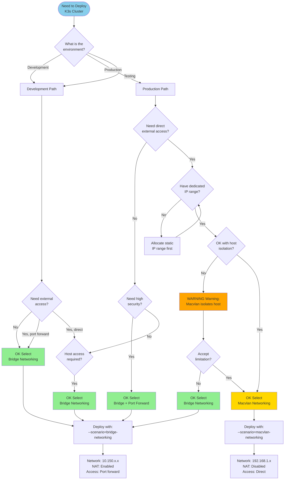
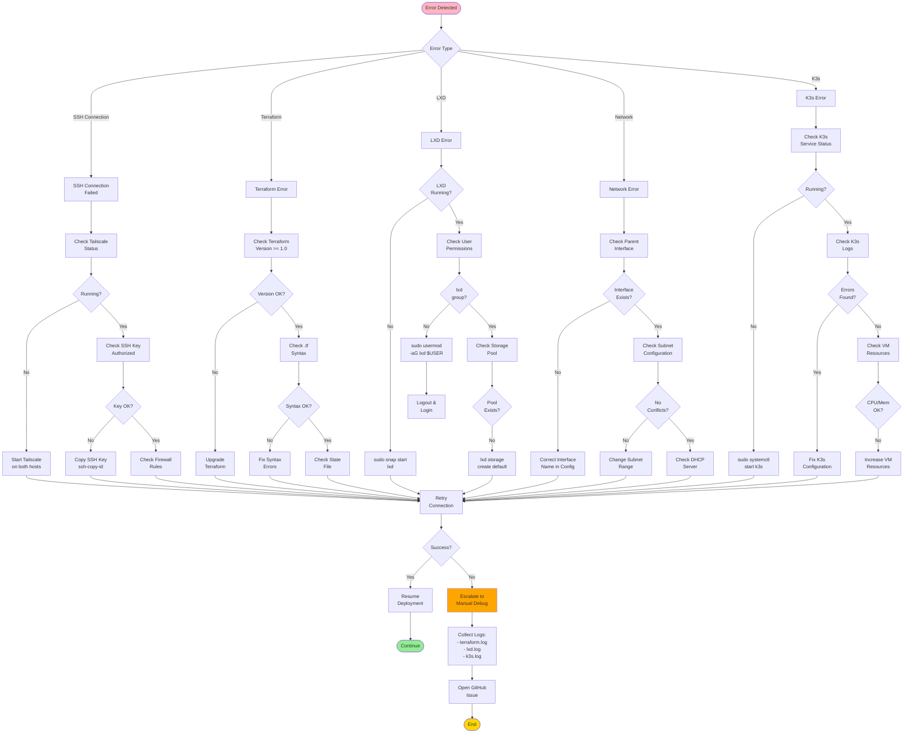

# SysML Activity Diagrams

This document contains SysML activity diagrams visualizing the deployment workflows for both network configurations.

## Table of Contents

1. [GitOps Overview](#1-gitops-overview)
2. [Bridge Networking Deployment](#2-bridge-networking-deployment)
3. [Macvlan Networking Deployment](#3-macvlan-networking-deployment)
4. [Network Selection Decision](#4-network-selection-decision)
5. [Error Handling Flow](#5-error-handling-flow)

---

## 1. GitOps Overview

High-level flow showing the complete GitOps workflow from developer push to running infrastructure.

```mermaid
flowchart TD
    Start([Developer Push]) --> GitPush[git push akash main]
    
    GitPush --> AkashReceive[Akash Container<br/>receives push]
    AkashReceive --> PostReceive[post-receive hook<br/>executes]
    
    PostReceive --> CloneRepo[Clone repo to<br/>workspace]
    CloneRepo --> UpdateSubmodule[Update terraform<br/>submodule]
    
    UpdateSubmodule --> SelectScenario{Select<br/>Scenario}
    SelectScenario -->|bridge-networking| BridgeDeploy[Deploy Bridge<br/>Networking]
    SelectScenario -->|macvlan-networking| MacvlanDeploy[Deploy Macvlan<br/>Networking]
    
    BridgeDeploy --> TailscaleConnect[Connect via<br/>Tailscale VPN]
    MacvlanDeploy --> TailscaleConnect
    
    TailscaleConnect --> FabricExecute[Fabric executes<br/>on Home LXD Host]
    
    FabricExecute --> TerraformInit[Terraform Init]
    TerraformInit --> TerraformPlan[Terraform Plan]
    TerraformPlan --> TerraformApply[Terraform Apply]
    
    TerraformApply --> CreateNetwork[Create LXD<br/>Network]
    CreateNetwork --> CreateVM[Create LXC<br/>VM]
    CreateVM --> InstallK3s[Install &<br/>Configure K3s]
    
    InstallK3s --> VerifyDeployment[Verify<br/>Deployment]
    VerifyDeployment --> RunTests[Run Connectivity<br/>Tests]
    
    RunTests --> Success{Tests<br/>Pass?}
    Success -->|Yes| DeployComplete([Deployment<br/>Complete])
    Success -->|No| Rollback[Rollback or<br/>Debug]
    Rollback --> VerifyDeployment
    
    DeployComplete --> Notify[Send<br/>Notification]
    
    style Start fill:#90EE90
    style DeployComplete fill:#90EE90
    style Rollback fill:#FFB6C1
```



---

## 2. Bridge Networking Deployment

Detailed flow for development scenario with bridge networking and NAT.

```mermaid
flowchart TD
    Start([Start Bridge<br/>Deployment]) --> SetVars[Set Environment<br/>Variables]
    
    SetVars --> TF_HOST[TF_HOST=<br/>100.x.y.z]
    SetVars --> TF_USER[TF_USER=ubuntu]
    SetVars --> SCENARIO[SCENARIO=<br/>bridge-networking]
    
    TF_HOST --> ConnectSSH[SSH to Home<br/>LXD Host]
    TF_USER --> ConnectSSH
    SCENARIO --> ConnectSSH
    
    ConnectSSH --> CheckDeps[Check<br/>Dependencies]
    CheckDeps --> CheckTerraform[Terraform<br/>Installed?]
    CheckDeps --> CheckLXD[LXD<br/>Installed?]
    CheckDeps --> CheckTailscale[Tailscale<br/>Connected?]
    
    CheckTerraform -->|No| ErrorExit1[Error: Install<br/>Terraform]
    CheckLXD -->|No| ErrorExit2[Error: Install<br/>LXD]
    CheckTailscale -->|No| ErrorExit3[Error: Start<br/>Tailscale]
    
    CheckTerraform -->|Yes| CloneRepo[Clone/Update<br/>Repository]
    CheckLXD -->|Yes| CloneRepo
    CheckTailscale -->|Yes| CloneRepo
    
    CloneRepo --> InitSubmodule[git submodule<br/>update --init]
    
    InitSubmodule --> ChangeDir[cd terraform/<br/>scenarios/bridge-networking]
    
    ChangeDir --> TerraformInit[terraform init]
    TerraformInit --> SelectWorkspace[terraform workspace<br/>select dev]
    
    SelectWorkspace --> TerraformPlan[terraform plan<br/>-var=ssh_public_key=...]
    
    TerraformPlan --> ReviewPlan{Review<br/>Plan}
    ReviewPlan -->|Abort| Exit1([Exit])
    ReviewPlan -->|Proceed| TerraformApply
    
    TerraformApply[terraform apply<br/>-var=ssh_public_key=...] --> CreateResources[Create Resources]
    
    CreateResources --> CreateNetwork[Create LXD<br/>Bridge Network<br/>k3s-dev-net]
    CreateNetwork --> NetworkConfig[Configure:<br/>- Subnet: 10.150.x.x/24<br/>- NAT: Enabled<br/>- DHCP: Enabled]
    
    NetworkConfig --> CreateProfile[Create LXD<br/>Profile<br/>k3s-dev-profile]
    
    CreateProfile --> LaunchVM[Launch LXC VM<br/>k3s-dev-cluster-01]
    LaunchVM --> VMConfig[Configure VM:<br/>- Ubuntu 22.04<br/>- 2 CPU<br/>- 4GB RAM<br/>- 20GB Disk]
    
    VMConfig --> CloudInit[Execute<br/>Cloud-Init]
    CloudInit --> CreateUser[Create ansible<br/>user]
    CreateUser --> SetupSSH[Setup SSH<br/>authorized_keys]
    SetupSSH --> InstallK3s[Install K3s<br/>Kubernetes]
    
    InstallK3s --> WaitReady[Wait for K3s<br/>Ready State]
    WaitReady --> HealthCheck[Health Check:<br/>systemctl status k3s]
    
    HealthCheck --> VerifyNetwork{Network<br/>OK?}
    VerifyNetwork -->|No| DebugNetwork[Debug:<br/>lxc network show<br/>k3s-dev-net]
    DebugNetwork --> HealthCheck
    
    VerifyNetwork -->|Yes| TestConnectivity[Test<br/>Connectivity]
    TestConnectivity --> PingGateway[Ping<br/>Gateway]
    TestConnectivity --> PingInternet[Ping<br/>Internet]
    TestConnectivity --> CheckSSH[SSH to<br/>ansible@VM_IP]
    
    CheckSSH --> AllTests{All Tests<br/>Pass?}
    AllTests -->|No| DebugTests[Debug:<br/>Check logs &<br/>config]
    DebugTests --> TestConnectivity
    
    AllTests -->|Yes| GetOutputs[Get Terraform<br/>Outputs]
    GetOutputs --> OutputIP[Output:<br/>k3s_node_ip = 10.150.x.y]
    GetOutputs --> OutputCmds[Output:<br/>check_commands]
    
    OutputCmds --> DisplayResults[Display<br/>Results]
    DisplayResults --> End([Bridge Deployment<br/>Complete])
    
    style Start fill:#90EE90
    style End fill:#90EE90
    style ErrorExit1 fill:#FFB6C1
    style ErrorExit2 fill:#FFB6C1
    style ErrorExit3 fill:#FFB6C1
```



### Bridge Networking Details

| Aspect | Configuration |
|--------|--------------|
| **Network Type** | LXD Bridge with NAT |
| **IP Range** | 10.150.x.x/24 (isolated subnet) |
| **Host Access** | Direct (same host) |
| **External Access** | Via port forwarding/NAT |
| **Use Case** | Development, testing |
| **Security** | Isolated from external network |
| **DNS** | Managed by LXD |
| **DHCP** | Enabled |

---

## 3. Macvlan Networking Deployment

Detailed flow for production scenario with macvlan networking.

```mermaid
flowchart TD
    Start([Start Macvlan<br/>Deployment]) --> SetVars[Set Environment<br/>Variables]
    
    SetVars --> TF_HOST[TF_HOST=<br/>100.x.y.z]
    SetVars --> TF_USER[TF_USER=ubuntu]
    SetVars --> SCENARIO[SCENARIO=<br/>macvlan-networking]
    
    TF_HOST --> PreCheck[Pre-Deployment<br/>Checks]
    TF_USER --> PreCheck
    SCENARIO --> PreCheck
    
    PreCheck --> CheckParent[Check Parent<br/>Interface]
    CheckParent --> IdentifyIface[Identify:<br/>eth0 or enp3s0]
    IdentifyIface --> VerifySubnet[Verify:<br/>192.168.1.x/24]
    
    VerifySubnet --> CheckConflicts{Check for<br/>IP Conflicts}
    CheckConflicts -->|Conflict| ResolveConflict[Resolve IP<br/>Conflict]
    ResolveConflict --> CheckConflicts
    
    CheckConflicts -->|No Conflict| ConnectSSH[SSH to Home<br/>LXD Host]
    
    ConnectSSH --> CheckDeps[Check<br/>Dependencies]
    CheckDeps --> CheckTerraform[Terraform<br/>Installed?]
    CheckDeps --> CheckLXD[LXD<br/>Installed?]
    CheckDeps --> CheckTailscale[Tailscale<br/>Connected?]
    
    CheckTerraform -->|No| ErrorExit1[Error: Install<br/>Terraform]
    CheckLXD -->|No| ErrorExit2[Error: Install<br/>LXD]
    CheckTailscale -->|No| ErrorExit3[Error: Start<br/>Tailscale]
    
    CheckTerraform -->|Yes| CloneRepo[Clone/Update<br/>Repository]
    CheckLXD -->|Yes| CloneRepo
    CheckTailscale -->|Yes| CloneRepo
    
    CloneRepo --> InitSubmodule[git submodule<br/>update --init]
    
    InitSubmodule --> ChangeDir[cd terraform/<br/>scenarios/macvlan-networking]
    
    ChangeDir --> TerraformInit[terraform init]
    TerraformInit --> SelectWorkspace[terraform workspace<br/>select prod]
    
    SelectWorkspace --> TerraformPlan[terraform plan<br/>-var=ssh_public_key=...]
    
    TerraformPlan --> ReviewPlan{Review<br/>Plan}
    ReviewPlan -->|Abort| Exit1([Exit])
    ReviewPlan -->|Proceed| TerraformApply
    
    TerraformApply[terraform apply<br/>-var=ssh_public_key=...] --> CreateResources[Create Resources]
    
    CreateResources --> CreateNetwork[Create LXD<br/>Macvlan Network<br/>k3s-prod-net]
    CreateNetwork --> NetworkConfig[Configure:<br/>- Parent: eth0<br/>- Type: macvlan<br/>- DHCP: External]
    
    NetworkConfig --> WarningHost[WARNING Warning:<br/>Host isolation<br/>enforced]
    
    WarningHost --> CreateProfile[Create LXD<br/>Profile<br/>k3s-prod-profile]
    
    CreateProfile --> LaunchVM[Launch LXC VM<br/>k3s-prod-cluster-01]
    LaunchVM --> VMConfig[Configure VM:<br/>- Ubuntu 22.04<br/>- 4 CPU<br/>- 8GB RAM<br/>- 50GB Disk]
    
    VMConfig --> CloudInit[Execute<br/>Cloud-Init]
    CloudInit --> CreateUser[Create ansible<br/>user]
    CreateUser --> SetupSSH[Setup SSH<br/>authorized_keys]
    SetupSSH --> InstallK3s[Install K3s<br/>Kubernetes]
    
    InstallK3s --> WaitReady[Wait for K3s<br/>Ready State]
    WaitReady --> HealthCheck[Health Check:<br/>systemctl status k3s]
    
    HealthCheck --> VerifyNetwork{Network<br/>OK?}
    VerifyNetwork -->|No| DebugNetwork[Debug:<br/>lxc network show<br/>k3s-prod-net<br/>Check parent iface]
    DebugNetwork --> HealthCheck
    
    VerifyNetwork -->|Yes| AssignIP[Get DHCP IP<br/>from router]
    AssignIP --> VerifyIP{IP in<br/>192.168.1.x?}
    VerifyIP -->|No| CheckRouter[Check Router<br/>DHCP leases]
    CheckRouter --> AssignIP
    
    VerifyIP -->|Yes| TestConnectivity[Test<br/>Connectivity]
    TestConnectivity --> PingGateway[Ping<br/>Gateway<br/>192.168.1.1]
    TestConnectivity --> PingInternet[Ping<br/>Internet<br/>8.8.8.8]
    TestConnectivity --> CheckSSH[SSH to<br/>ansible@VM_IP]
    TestConnectivity --> TestExternal[Test from<br/>External Client]
    
    TestExternal --> VerifyHostIsolation{Host<br/>isolated?}
    VerifyHostIsolation -->|No| Warning[WARNING Security<br/>Warning]
    Warning --> Continue
    VerifyHostIsolation -->|Yes| Continue[Continue]
    
    Continue --> CheckK3s[K3s API<br/>Accessible?]
    CheckK3s -->|No| DebugK3s[Debug K3s<br/>config]
    DebugK3s --> CheckK3s
    
    CheckK3s -->|Yes| AllTests{All Tests<br/>Pass?}
    AllTests -->|No| DebugTests[Debug:<br/>Check logs &<br/>config]
    DebugTests --> TestConnectivity
    
    AllTests -->|Yes| GetOutputs[Get Terraform<br/>Outputs]
    GetOutputs --> OutputIP[Output:<br/>k3s_node_ip = 192.168.1.x]
    GetOutputs --> OutputCmds[Output:<br/>check_commands]
    
    OutputCmds --> DisplayResults[Display<br/>Results]
    DisplayResults --> Note[Note:<br/>Host cannot reach VM<br/>Use external client]
    Note --> End([Macvlan Deployment<br/>Complete])
    
    style Start fill:#FFD700
    style End fill:#FFD700
    style Warning fill:#FFA500
    style ErrorExit1 fill:#FFB6C1
    style ErrorExit2 fill:#FFB6C1
    style ErrorExit3 fill:#FFB6C1
```



### Macvlan Networking Details

| Aspect | Configuration |
|--------|--------------|
| **Network Type** | LXD Macvlan (L2 bridging) |
| **IP Range** | 192.168.1.x/24 (host subnet) |
| **Host Access** | [X] Isolated (L2 limitation) |
| **External Access** | [OK] Direct from network |
| **Use Case** | Production, services |
| **Security** | VMs isolated from host |
| **DNS** | External (router/DNS server) |
| **DHCP** | External (router) |
| **Requirements** | Parent interface, static IP range |

---

## 4. Network Selection Decision

Decision diagram for choosing between bridge and macvlan networking.



### Decision Matrix

| Criteria | Bridge | Macvlan |
|----------|--------|---------|
| **Development** | [OK] Best choice | [WARNING] Overkill |
| **Production** | [WARNING] Limited | [OK] Best choice |
| **Host Access Required** | [OK] Yes | [X] No |
| **Direct External Access** | [WARNING] Port forward | [OK] Native |
| **Network Isolation** | [OK] High | [WARNING] Medium |
| **Simple Setup** | [OK] Yes | [WARNING] More complex |
| **Multiple IPs Available** | N/A | [OK] Required |

---

## 5. Error Handling Flow

Common error scenarios and recovery procedures.



### Error Recovery Commands

```bash
# SSH Issues
ssh -v user@host                    # Verbose SSH
sudo systemctl status tailscaled    # Check Tailscale
tailscale status                    # Check Tailscale status

# Terraform Issues
terraform validate                  # Validate config
terraform fmt                       # Format code
terraform refresh                   # Refresh state

# LXD Issues
sudo snap services lxd              # Check LXD service
lxc info                            # Check LXD info
sudo usermod -aG lxd $USER          # Add user to group

# Network Issues
ip addr show                        # Check interfaces
lxc network list                    # List LXD networks
lxc network show <network>          # Show network details

# K3s Issues
sudo systemctl status k3s           # Check K3s status
sudo journalctl -u k3s -f           # Follow K3s logs
sudo kubectl get nodes              # Check K3s nodes
```

---

## Legend

| Symbol | Meaning |
|--------|---------|
| [GREEN] Green | Start/End, Success states |
| [YELLOW] Yellow | Warnings, Production paths |
| [RED] Red | Errors, Failure states |
| [ORANGE] Orange | Warnings, Caution required |
| [BLUE] Blue | Decision points |
| [WHITE] White | Process steps |

---

## Notes

- All diagrams use **Mermaid syntax** (native GitHub support)
- Copy diagram code into [Mermaid Live Editor](https://mermaid.live/) for visual editing
- Diagrams are automatically rendered in GitHub markdown
- For complex modifications, use the Live Editor and export back
